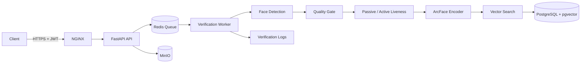

````markdown
# FaceID Core

### Production-oriented Face Verification Service

Backend-сервис биометрической верификации для систем
контроля физического доступа.

Система определяет:

- совпадает ли лицо с зарегистрированным пользователем;
- является ли объект живым человеком, а не spoofing-атакой;
- достаточно ли качественный кадр для надёжной проверки.

Сервис работает через HTTP API и может интегрироваться
с внешними системами СКУД, приложениями и терминалами.

> ⚠️ Проект предназначен для демонстрации инженерного
> подхода к разработке систем компьютерного зрения.
> Использование биометрии в реальных системах требует
> соответствующей юридической, организационной и
> security-проверки.

---

# 🎯 Problem

Для системы контроля доступа недостаточно просто
сравнить два изображения лица.

Практическая система должна учитывать сразу несколько
факторов:

```text
Face Verification
       │
       ├── Is this the right person?
       │
       ├── Is this a real person?
       │
       └── Is the captured image good enough?
````

Поэтому FaceID Core объединяет:

* face detection;
* image quality assessment;
* face recognition;
* passive liveness;
* active liveness challenge;
* similarity / confidence thresholds;
* asynchronous processing;
* secure biometric storage.

---

# 💡 Solution

Основной pipeline:

```text
Client
  │
  ▼
FastAPI
  │
  ▼
Redis Queue
  │
  ▼
Verification Worker
  │
  ▼
┌──────────────────────┐
│   ML Pipeline         │
│                      │
│ Face Detection       │
│        ↓             │
│ Quality Gate         │
│        ↓             │
│ Liveness             │
│        ↓             │
│ ArcFace Embedding    │
│        ↓             │
│ Vector Search        │
│        ↓             │
│ Decision              │
└──────────────────────┘
  │
  ▼
Verification Result
```

---

# ✨ Key Features

### 👤 Face Verification

Система сравнивает лицо пользователя
с зарегистрированным эталоном.

Результат может быть:

```text
match
no_match
low_confidence
```

### 🛡️ Anti-Spoofing

Поддерживаются два уровня проверки живости:

* passive liveness;
* active challenge.

Active challenge использует интерактивные действия:

```text
turn
nod
blink
```

что позволяет защищаться от статичных изображений
и некоторых replay/cutout сценариев.

### 📷 Quality Gate

Перед распознаванием система проверяет качество
изображения:

* blur;
* brightness;
* contrast;
* face size;
* pose;
* occlusion;
* lighting.

Непригодный кадр может привести к:

```text
quality_reject
```

или:

```text
retry
```

Важное отличие:

`retry` означает не отказ в доступе,
а запрос на повторную съёмку.

### ⚡ Async Processing

Тяжёлые операции могут выполняться
асинхронно через Redis queue.

```text
HTTP Request
     ↓
Redis Queue
     ↓
Worker
     ↓
ML Pipeline
     ↓
Result
```

---

# 🏗️ Architecture



Основные компоненты:

```text
FastAPI
   ↓
Redis
   ↓
Worker
   ↓
ML Pipeline
   ↓
PostgreSQL + pgvector
```

MinIO используется как временное хранилище
для асинхронной обработки файлов.

---

# 🧠 ML Pipeline

## 1. Face Detection

Для обнаружения лица используются
SCRFD / RetinaFace.

```text
Image
  ↓
Face Detection
  ↓
Face Bounding Box
  ↓
Landmarks
```

---

## 2. Quality Gate

Проверяется пригодность кадра
для дальнейшего распознавания.

```text
Blur
Brightness
Contrast
Pose
Face Size
Occlusion
Lighting
```

В зависимости от конфигурации quality gate
может работать в режимах:

```text
hard
soft
off
```

---

## 3. Liveness

### Passive Liveness

Используется модель:

```text
MiniFASNetV2
```

Она выполняет быстрый anti-spoofing check
без взаимодействия с пользователем.

### Active Liveness

Для сценариев с повышенными требованиями
используется challenge protocol.

```text
Challenge Init
      ↓
WebSocket Stream
      ↓
Turn / Nod / Blink
      ↓
Liveness Verification
      ↓
Single-use Liveness Token
      ↓
Face Verification
```

Такой подход позволяет вынести активную проверку
в отдельный security gate.

---

# 🔐 Face Recognition

После успешного прохождения quality/liveness checks
система строит face embedding.

Используется:

```text
InsightFace
      ↓
ArcFace
      ↓
ONNX Runtime
```

Полученный embedding сравнивается
с зарегистрированным эталоном.

Для vector search используется:

```text
PostgreSQL
+
pgvector
```

Также предусмотрена интеграция с FAISS.

---

# 📊 Verification Result

API возвращает структурированный результат.

Пример статусов:

| Status              | Meaning                          |
| ------------------- | -------------------------------- |
| `match`             | лицо совпало                     |
| `no_match`          | лицо не найдено среди эталонов   |
| `low_confidence`    | результат находится в серой зоне |
| `spoof_detected`    | обнаружена spoofing-атака        |
| `quality_reject`    | изображение непригодно           |
| `retry`             | необходимо повторить съёмку      |
| `processing_failed` | техническая ошибка               |

Пример логики:

```text
Image
  ↓
Quality OK?
  │
  ├── No → quality_reject / retry
  │
  ▼
Liveness OK?
  │
  ├── No → spoof_detected
  │
  ▼
Face Embedding
  ↓
Vector Search
  ↓
Similarity
  ↓
Decision
```

---

# 🔌 API

Основные endpoints:

| Method | Endpoint                            | Purpose                  |
| ------ | ----------------------------------- | ------------------------ |
| POST   | `/api/v1/upload`                    | регистрация эталона      |
| POST   | `/api/v1/upload_base64`             | регистрация через base64 |
| POST   | `/api/v1/verify`                    | синхронная верификация   |
| POST   | `/api/v1/verify_base64`             | async verification       |
| POST   | `/api/v1/verify_async`              | async verification       |
| GET    | `/api/v1/jobs/{job_id}`             | статус задачи            |
| GET    | `/api/v1/jobs/{job_id}/stream`      | SSE status stream        |
| POST   | `/api/v1/liveness`                  | passive liveness         |
| POST   | `/api/v1/liveness/challenge/init`   | active challenge         |
| WS     | `/api/v1/liveness/challenge/stream` | challenge stream         |
| PUT    | `/api/v1/update-reference`          | обновление эталона       |
| GET    | `/api/v1/status`                    | состояние сервиса        |

Swagger:

```text
http://localhost:8000/docs
```

---

# 🔒 Security

Биометрические данные требуют отдельного
подхода к безопасности.

В проекте реализованы:

### Encryption

Face embeddings шифруются:

```text
AES-256
```

Ключ хранится во внешней конфигурации.

### No Permanent Photo Storage

Исходные изображения не используются
как постоянное хранилище биометрических данных.

После извлечения embedding исходный кадр удаляется.

MinIO используется как transit storage
для async processing.

### Log Redaction

Логи очищаются от:

* base64 image blobs;
* embeddings;
* биометрических данных.

### Authentication

API поддерживает:

```text
JWT
X-API-Key
```

### Additional Protection

Также предусмотрены:

* rate limiting;
* backpressure;
* queue-delay admission control;
* anti-replay protection.

---

# 🐳 Deployment

Проект контейнеризован с помощью Docker Compose.

## CPU

```bash
docker compose up -d --build
```

Поднимаются:

```text
PostgreSQL
Redis
MinIO
FastAPI
Worker
NGINX
Prometheus
```

## GPU

Для CUDA:

```bash
docker compose \
  -f docker-compose.yml \
  -f docker-compose.gpu.yml \
  up -d --build
```

GPU override переключает inference
на CUDA / ONNX Runtime GPU.

Архитектура поддерживает fallback:

```text
CUDA
 ↓
DirectML
 ↓
CPU
```

---

# 🖥️ Demo GUI

Для демонстрации проекта предусмотрен
web-based Demo GUI.

```text
/demo/
```

Интерфейс позволяет показать:

* Upload;
* Verify;
* Liveness;
* Active Challenge;
* Config.

Запуск:

```bash
docker compose \
  -f docker-compose.yml \
  -f docker-compose.demo.yml \
  up -d --build
```

После запуска:

```text
http://localhost:8000/demo/
```

> Demo GUI предназначен для презентаций
> и локальной демонстрации, а не для production deployment.

---

# 🧪 Testing

Проект содержит unit и integration tests.

### Unit

```bash
python -m pytest tests/unit -q
```

### Full Suite

```bash
python -m pytest -q
```

### Coverage

```bash
python -m pytest \
  --cov=app \
  --cov-branch \
  --cov-report=term-missing
```

CI может использовать coverage gate:

```bash
python -m pytest \
  --cov=app \
  --cov-branch \
  --cov-fail-under=90
```

---

# 📈 Observability

Для мониторинга используются:

```text
Prometheus
+
Grafana
+
Structured JSON Logs
```

Отслеживаются, в частности:

* queue delay;
* pipeline latency;
* detection latency;
* encoding latency;
* quality rejects;
* liveness results;
* verification results.

Биометрические данные удаляются
из логов через redaction layer.

---

# 🛠️ Tech Stack

| Technology         | Purpose                  |
| ------------------ | ------------------------ |
| Python 3.11        | Backend                  |
| FastAPI            | REST API                 |
| Pydantic v2        | Data validation          |
| SQLAlchemy 2       | Database access          |
| PostgreSQL         | Persistent storage       |
| pgvector           | Vector search            |
| Redis              | Queue / cache            |
| Celery             | Async workers            |
| MinIO              | Temporary object storage |
| InsightFace        | Face recognition         |
| ArcFace            | Face embeddings          |
| SCRFD / RetinaFace | Face detection           |
| MiniFASNetV2       | Passive liveness         |
| ONNX Runtime       | ML inference             |
| OpenCV             | Image processing         |
| Docker Compose     | Deployment               |
| Prometheus         | Metrics                  |
| Grafana            | Monitoring               |

---

# 📁 Project Structure

```text
faceid-core/
│
├── app/
│   ├── api/
│   ├── core/
│   ├── ml/
│   ├── services/
│   └── ...
│
├── tests/
│   └── unit/
│
├── docs/
│   ├── deploy-runbook.md
│   ├── dashboard_guide.md
│   ├── two-node-stand.md
│   ├── slo.md
│   ├── demo-guide.md
│   ├── recognition-accuracy-assessment.md
│   ├── liveness-accuracy-assessment.md
│   ├── crypto-rsa-assessment.md
│   └── ...
│
├── docker-compose.yml
├── docker-compose.gpu.yml
├── docker-compose.demo.yml
├── requirements.txt
└── ...
```

---

# 🎯 Engineering Highlights

Этот проект демонстрирует не только использование
готовой ML-модели, но и построение полноценного
backend-сервиса вокруг computer vision pipeline.

### Computer Vision

* face detection;
* face embeddings;
* similarity search;
* liveness detection;
* image quality assessment;
* anti-spoofing.

### Backend Engineering

* FastAPI;
* asynchronous processing;
* Redis queues;
* Celery workers;
* PostgreSQL;
* pgvector;
* MinIO;
* REST API;
* WebSocket;
* SSE.

### Production Engineering

* Docker;
* CPU/GPU deployment;
* health checks;
* monitoring;
* structured logging;
* authentication;
* rate limiting;
* backpressure;
* security controls.

### AI Engineering

* ONNX inference;
* model/provider abstraction;
* ML pipeline orchestration;
* threshold calibration;
* evaluation of recognition/liveness quality.

---

# ⚠️ Known Limitations

Проект имеет несколько известных ограничений.

### Passive Liveness

Passive liveness не является универсальной защитой
от всех типов spoofing attacks.

Для high-security сценариев предусмотрен
active liveness gate.

### Quality Detection

Некоторые эвристики quality/occlusion detection
могут давать false positive.

В таких случаях система возвращает:

```text
retry
```

вместо безусловного отказа.

### Worker Metrics

Worker-side latency не полностью представлена
в Prometheus multiprocess режиме и дополнительно
контролируется через structured logs.

### Production Validation

Пороговые значения и ML quality metrics требуют
калибровки на конкретном deployment environment
и целевой камере.

---

# 📚 Documentation

Подробные технические материалы:

* [Deployment Runbook](docs/deploy-runbook.md)
* [Dashboard Guide](docs/dashboard_guide.md)
* [Two-node Stand](docs/two-node-stand.md)
* [SLO](docs/slo.md)
* [Demo Guide](docs/demo-guide.md)
* [Recognition Accuracy Assessment](docs/recognition-accuracy-assessment.md)
* [Liveness Accuracy Assessment](docs/liveness-accuracy-assessment.md)
* [Crypto Assessment](docs/crypto-rsa-assessment.md)

---

# 👨‍💻 Author

**Alexsey**

AI Developer · Prompt Engineer · AI Automation · Vibe Coder

GitHub: [https://github.com/Alexsey111](https://github.com/Alexsey111)

```
