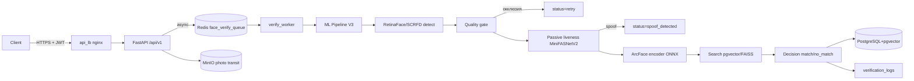

# FaceID Core

**FaceID Core** — сервис распознавания лиц для **контроля физического доступа на
объект** (проходная, СКУД, защищаемое помещение). Человек предъявляет лицо камере,
сервис за секунду отвечает: «свой — открыть» или «чужой / подмена — отказать».

## Зачем это нужно

Задача — заменить/дополнить карточку или код пропуска биометрией, которую нельзя
передать другому или подделать фотографией. Сервис решает три вопроса одновременно:

1. **Узнаёт ли это тот самый человек?** — сравнивает лицо с заранее записанным эталоном
   и выдаёт уверенное «да»/«нет» (или «не уверен — проверьте повторно»).
2. **Живой ли это человек, а не фото/маска/экран?** — проверяет живость (liveness),
   в том числе через интерактивную проверку: система просит моргнуть/повернуть голову,
   что статичная подделка выполнить не может.
3. **Достаточно ли хорошее фото?** — отбрасывает размытые/тёмные/перекрытые кадры и
   просит переснять, чтобы не ошибиться из-за плохого снимка.

Это **бэкенд-сервис**: он не хранит исходные фотографии людей и не показывает
интерфейс оператору. Его вызывает внешняя система (СКУД, приложение, киоск) по HTTP,
получает структурированный ответ и уже сама решает, открыть дверь или нет.

## Что делает система (по шагам)

1. **Запись эталона.** Впервые человек предъявляет лицо → сервис выделяет лицо,
   превращает его в зашифрованный числовой «отпечаток» (эмбеддинг) и сохраняет под
   идентификатором пользователя. Само фото после этого удаляется.
2. **Проверка при проходе.** Человек предъявляет лицо → сервис:
   - находит лицо на кадре и оценивает качество (размытие, освещение, окклюзия);
   - проверяет живость — сначала «пассивно» по одному кадру, при высоких
     требованиях к безопасности — «активно» через интерактивный протокол
     (повернуть голову, моргнуть);
   - строит эмбеддинг и ищет ближайший эталон в базе;
   - принимает решение: `match` (свой) / `no_match` (чужой) / `low_confidence`
     (серая зона — повторить или подтвердить активной проверкой).
3. **Ответ вызывающей системе** — статус, уверенность, оценка живости и причина, если
   доступ отклонён. Фото-кадр после обработки удаляется.

## Кому это подходит

Операторам СКУД и службам безопасности, которым нужна биометрическая верификация
«по лицу» с защитой от подмены фотографией/видео/вырезом, работающая через API и
готовая к развёртыванию в Docker. Это не потребительское приложение и не система
массового учёта — это проверочная служба для точки прохода.

## Стек и развёртывание (кратко)

Backend на FastAPI, ML на InsightFace/ONNX, хранилище PostgreSQL+pgvector, MinIO,
Redis. Docker Compose deploy (CPU по умолчанию, GPU-override для CUDA-хостов).
Подробности — в технических разделах ниже.

> Подробный операционный runbook — [`docs/deploy-runbook.md`](docs/deploy-runbook.md).
> Мониторинг — [`docs/dashboard_guide.md`](docs/dashboard_guide.md). Двухнодовый стенд —
> [`docs/two-node-stand.md`](docs/two-node-stand.md). SLO — [`docs/slo.md`](docs/slo.md).
> Демо-GUI для презентаций — [`docs/demo-guide.md`](docs/demo-guide.md).
> Оценки соответствия ТЗ: [recognition/FRR](docs/recognition-accuracy-assessment.md),
> [liveness-accuracy](docs/liveness-accuracy-assessment.md),
> [crypto/RSA](docs/crypto-rsa-assessment.md),
> [3D-depth/deepfake](docs/liveness-3d-depth-deepfake-assessment.md),
> [quality-gaps](docs/quality-minor-gaps-assessment.md).

---

## Статусы ответа — что значат для оператора

| Статус | Смысл по-человечески | Что делать |
|---|---|---|
| `match` | Свой — лицо совпало с эталоном и проверка живости пройдена | открыть доступ |
| `no_match` | Чужой — лица нет в базе | отказать |
| `low_confidence` | Серая зона — похоже, но не уверенно | запросить активную проверку (challenge) или повторный снимок |
| `spoof_detected` | Подмена — это фото/экран/маска, не живой человек | отказать, зафиксировать попытку |
| `quality_reject` | Кадр непригоден (тёмно/размыто/мало лица) | попросить переснять |
| `retry` | Лицо перекрыто (маска, очки) — это не отказ, а просьба снять окклюзию | снять и переснять |
| `processing_failed` | Технический сбой обработки | повторить запрос; при повторе — разобраться с сервисом |

---

## Архитектура



**Поток верификации:** API → async-очередь `face_verify_queue` → `verify_worker` →
ML Pipeline → детект → quality-gate → passive liveness → ArcFace-эмбеддинг →
поиск по pgvector/FAISS → decision. При `liveness_mode="active"` liveness доказана
WS-challenge-протоколом (см. ниже), passive в `/verify` не запускается.

---

## Liveness (anti-spoof)

### Passive — MiniFASNetV2 (yakhyo)

Дешёвый барьер на каждый кадр, без интерактива.

| Параметр | Значение |
|---|---|
| Модель | `models/MiniFASNetV2_yakhyo.onnx` |
| Вход | 80×80, BGR, 0–255 (без /255), квадратный кроп `crop_face_square(scale=2.7)` |
| Выход | 3 логита `[dead(idx0), real(idx1), spoof(idx2)]` — эффективно бинарная |
| Порог | `LIVENESS_THRESHOLD = 0.859` (`real=softmax[idx1]`) |
| Индикаторы | `spoofing_indicators = {real_prob, spoof_prob}` (idx0 не выносится) |

Модель **не различает типы атак** (print/replay/cutout) — только real/spoof.
Latency ≈ 8–10 мс (CPU), <1% от encode.

### Active challenge — gate допуска (cutout-защита)

Passive **не различает cutout-атаку** (фото с вырезом) — классифицирует как `real`
P=0.976. Для допуска на объект (high-security) этого недостаточно. Решение —
**active challenge как обязательный gate**:

```text
POST /api/v1/liveness/challenge/init  → challenge_id + ws_token + actions (turn/nod/blink)
WS   /api/v1/liveness/challenge/stream → стрим кадров → verify_challenge_stream
                                        → is_live=True → liveness_token (single-use, TTL)
POST /api/v1/verify_base64             → liveness_mode="active" + liveness_token
```

Cutout/print — статичны, действия не выполняют → `is_live=False` → токен не выдаётся
→ `/verify` без токена → `403 active_liveness_required`.

Тумблер `LIVENESS_ACTIVE_REQUIRED` (default `false`, backward-compat):
- `false` — passive-допуск разрешён (текущие deploys не ломаются);
- `true` — high-security: при `require_liveness=true` допуск **только** через active
  proof. Точки gate: `_resolve_liveness` (`/verify_base64`, `/verify_async_base64`),
  `/verify_async_file`, `/verify_async` (JSON), defense-in-depth в worker.

> **ТЗ «Liveness ≥98%» = security-цель (spoof-rejection), не формальная frame-accuracy.**
> Frame-passive accuracy 0.9124 — baseline, не production-verdict. Соответствие ТЗ
> достигается двумя рычагами: (1) active-gate — spoof-rejection 100%
> (`LIVENESS_ACTIVE_REQUIRED=true`); (2) video-temporal aggregation в challenge-стриме
> — AUC=1.0, cutout APCER=0. См. [`docs/liveness-accuracy-assessment.md`](docs/liveness-accuracy-assessment.md).
> При default `LIVENESS_ACTIVE_REQUIRED=false` passive = frame-level (0.9124) —
> для доступа по ТЗ ≥98% включать active-gate.

> Active proof принимает только `/verify_base64` (liveness_mode=active + liveness_token).
> Multipart-эндпоинты (`/verify`, `/verify_async_file`) токен не несут — для
> access-control не использовать.

---

## Quality gate

Многоуровневая проверка качества на кропе лица + 5-pt landmarks (cv2, sub-ms, без
отдельной ONNX-модели). Режимы `QUALITY_GATE_MODE` / `QUALITY_LIGHTING_MODE` /
`POSE_QUALITY_MODE`: `hard` (отбрасывать) / `soft` (warning-only, защищает TAR) / `off`.

| Класс | Что | Результат |
|---|---|---|
| Capture-качество | blur, brightness, contrast, min face side, pose | `status="quality_reject"` (в `hard`) |
| Освещение | uniformity 3×3 grid, shadow asymmetry | `bad_lighting` / `hard_shadow` (`QUALITY_LIGHTING_MODE`) |
| **Окклюзия** | маска И очки (skin-tone / edge-density эвристики) | **`status="retry"`, `reason="remove_occlusion"`** |

**Окклюзия — не отказ, а запрос пере-съёмки**: клиент по `quality_details.occlusion_flags`
(`mask_detected`, `glasses_detected`) просит снять окклюзию и пере-вызывает `/verify`.
Верификация (match/no_match) считается **только** по чистому лицу — точность
распознавания сохраняется. Тумблеры `QUALITY_MASK_DETECT_ENABLED`,
`QUALITY_GLASSES_DETECT_ENABLED`.

При сомнениях в match-margin (серая зона `CHALLENGE_MARGIN_LOW/HIGH`) — в ответе
`challenge_recommended: true` (клиент зовёт active challenge).

---

## API контракт

Все бизнес-эндпоинты под префиксом **`/api/v1`** (health/ready/docs без префикса),
защита JWT/X-API-Key (`AUTH_ENABLED=false` для dev).

| Метод | Путь | Назначение |
|---|---|---|
| POST | `/api/v1/upload` | загрузка эталона (multipart) |
| POST | `/api/v1/upload_base64` | загрузка эталона (base64) |
| POST | `/api/v1/verify` | верификация (multipart) |
| POST | `/api/v1/verify_base64` | верификация (base64, async `face_verify_queue`) — **носит active liveness** |
| POST | `/api/v1/verify_async_file` | async: file → MinIO → очередь |
| POST | `/api/v1/verify_async_base64` | async: base64 → очередь |
| POST | `/api/v1/verify_async` | async JSON (admission-control) |
| POST | `/api/v1/liveness` | passive liveness (standalone) |
| POST | `/api/v1/liveness/challenge/init` | active challenge init |
| WS | `/api/v1/liveness/challenge/stream` | active challenge стрим → liveness_token |
| GET | `/api/v1/verify_result/{job_id}` | статус async-задачи (legacy-алиас `/jobs/{job_id}`) |
| GET | `/api/v1/jobs/{job_id}` | статус async-задачи |
| GET | `/api/v1/jobs/{job_id}/stream` | SSE-стрим статуса async-задачи |
| GET | `/api/v1/jobs/{job_id}/wait` | блокирующее ожидание результата |
| GET | `/api/v1/status` | сводка состояния сервиса |
| GET | `/api/v1/config` | публичные пороги (для демо-GUI; без секретов) |
| PUT | `/api/v1/update-reference` | обновление эталона |
| GET | `/health`, `/ready`, `/metrics` | без префикса `/api/v1`; health/ready открыты, `/metrics` под auth |

**Ответ `/verify`** (`VerifyResponse`): `status` (`match` / `low_confidence` /
`no_match` / `spoof_detected` / `quality_reject` / `retry` / `processing_failed`),
`match_score` (= legacy `similarity`), `confidence` (`high` ≥0.45 / `medium` ≥0.3 /
`low` / `null`), `liveness_passed`, `liveness_score`, `spoofing_indicators`
(`{real_prob, spoof_prob}`), `quality_details` (включая `occlusion_flags`:
`mask_detected`, `glasses_detected`), `reason`, `error_code`, `queue_wait_ms`,
`challenge_recommended`.

Пороги: `FACE_MATCH_THRESHOLD=0.45` (match, = `HIGH_THRESHOLD`; калиброван под
ТЗ FRR≤3% на LFW single-face — см.
[recognition-assessment](docs/recognition-accuracy-assessment.md)), `FACE_LOW_THRESHOLD=0.3`
(no_match = `LOW_THRESHOLD`), `SIM_THRESHOLD=0.30` (pre-filter поиска = LOW_THRESHOLD,
не срезает low_confidence-band [0.3, 0.45)).

---

## Безопасность (152-ФЗ)

- **Эмбеддинги шифруются AES-256** при записи в БД (`ENCRYPTION_KEY` — секрет окружения).
  Content-hash (`encrypted_hash`, sha256 от plaintext) хранится отдельно для
  idempotency/lookup без decrypt-all (ТЗ-схема).
- **Исходные фото не хранятся**: после извлечения эмбеддинга байт-картинка удаляется;
  MinIO используется только как транзит для async-задач (воркер удаляет объект после
  обработки).
- **Логи без биометрии**: `app/core/logger.py` → `BiometryRedactionFilter` вычищает
  base64-блобы, ndarray-эмбеддинги, биометрические ключи (defense-in-depth в
  `JsonFormatter`).
- **HTTPS + JWT**: продакшн-трафик через `api_lb` (nginx, :8443 TLS); JWT/X-API-Key на
  всех бизнес-эндпоинтах.
- **Rate limiting**, backpressure (queue-delay admission control), anti-replay.

---

## Deploy

### Локальная установка

Для запуска вне Docker нужен Python 3.11. Зависимости зафиксированы в
[`requirements.txt`](requirements.txt):

```bash
python -m venv .venv
.venv\\Scripts\\python -m pip install -r requirements.txt  # Windows
# .venv/bin/python -m pip install -r requirements.txt       # Linux/macOS
```

Конфигурацию для локального запуска возьмите из `.env.prod.example`; секреты и
ключи не добавляйте в репозиторий.

### CPU (dev / production без GPU)

```bash
docker compose up -d --build
```

Поднимает postgres (pgvector), redis, minio, api, api_lb, worker, prometheus.
Healthcheck'и + `restart: unless-stopped` на долгоживущих сервисах (см. runbook).
Profile-сервисы (`worker_metrics`, `worker_fast`/`worker_heavy`,
`autoscaler`) подключаются через `--profile`.

### GPU (production с CUDA)

```bash
docker compose -f docker-compose.yml -f docker-compose.gpu.yml up -d --build
```

Override переключает `api`/`worker` на CUDA-образы (`nvidia/cuda:11.8 + cuDNN 8`,
`onnxruntime-gpu`), резервирует GPU, ставит `ONNX_ARCFACE_PROVIDERS=cuda`, поднимает
`EMBED_BATCH_SIZE`. Требует nvidia-container-toolkit. Код энкодера имеет
CUDA→DML→CPU fallback (`ONNX_ARCFACE_PROVIDERS=auto` default).

> Локальная dev-машина без NVIDIA CUDA — только CPU-сборка; архитектура под CPU не
> сужается (production может быть на GPU-хостах).

### Demo-GUI (презентации, не production)

Single-page vanilla-JS GUI на `/demo/` (веб-камера → API, same-origin на
`localhost:8000`, без CORS/HTTPS): табы Upload/Verify/Liveness/Active Challenge/Config.
Кадры только в памяти (canvas → fetch → GC), без localStorage/логов биометрии.

```bash
docker compose -f docker-compose.yml -f docker-compose.demo.yml up -d --build
# открыть http://localhost:8000/demo/  (AUTH_ENABLED=false, liveness+active включены)
```

`docker-compose.demo.yml` — явный dev-override (`AUTH_ENABLED=false`,
`LIVENESS_ENABLED=true`, `LIVENESS_ACTIVE_ENABLED=true`), base-файл не правится.
Production: убрать mount `/demo` или защитить auth+HTTPS. См.
[`docs/demo-guide.md`](docs/demo-guide.md).

### Конфигурация

Основные тумблеры (env / `app/core/config.py`): `LIVENESS_ENABLED`,
`LIVENESS_ACTIVE_ENABLED`, `LIVENESS_ACTIVE_REQUIRED`, `LIVENESS_THRESHOLD=0.859`,
`FACE_MATCH_THRESHOLD=0.45` (= `HIGH_THRESHOLD`, match; калиброван под ТЗ FRR≤3%),
`ONNX_ARCFACE_PROVIDERS=auto`, `ARCFACE_MODEL_REL=buffalo_l/w600k_r50.onnx`,
`QUALITY_GATE_MODE`, `AUTH_ENABLED`, `FAISS_ENABLED`. Полный список — в config и runbook.

---

## Тестирование и coverage

```bash
# unit-набор (без DB/Redis)
python -m pytest tests/unit -q

# полный suite (unit + integration; требует postgres_test/redis)
python -m pytest -q

# coverage (измерение, без gate)
python -m pytest --cov=app --cov-branch --cov-report=term-missing

# coverage gate (CI, KPI ≥90% на полном suite)
python -m pytest --cov=app --cov-branch --cov-fail-under=90
```

`fail_under` намеренно не зашит в `pyproject.toml` — чтобы `pytest --cov` на частичных
прогонах не падал; gate задаётся явным `--cov-fail-under` в CI. Конфиг coverage:
`[tool.coverage.run]` (source=`app`, branch) в `pyproject.toml`. Текущее покрытие
unit-only ≈39%, выше с integration; цель — ratchet к 90%.

---

## Observability

- Prometheus + Grafana: `docs/grafana_dashboard.json`, `docs/dashboard_guide.md`.
- Метрики: `queue_delay_ms`, `pipeline_ms`, `detect_ms`, `encode_ms`, `quality_reject`,
  verify-result counter, liveness pass/fail. Worker-side latency — через logs
  (Celery prefork ≠ Prometheus multiprocess из коробки).
- Structured JSON-логи с redaction (биометрия вычищается).

---

## Стек

Python 3.11, FastAPI, Pydantic v2, SQLAlchemy 2 (async), Celery, Redis, PostgreSQL+pgvector,
MinIO, InsightFace (ArcFace `buffalo_l/w600k_r50`), SCRFD/RetinaFace detect, ONNX Runtime,
OpenCV. Инфра: Docker Compose (Kubernetes опционально).

## Ограничения

- Passive liveness не различает cutout — закрыто active-gate (политикой, не моделью).
- Cutout-эвристика (маска/очки) грубая — ложный retry стоит недорого (пере-съёмка),
  ложный пропуск отключается тумблером; пороги вынесены в config для калибровки.
- Multipart `/verify` не поддерживает active proof — для access-control использовать
  `/verify_base64`.
- Полноценный Prometheus multiprocess для worker-side latency не реализован (logs).
